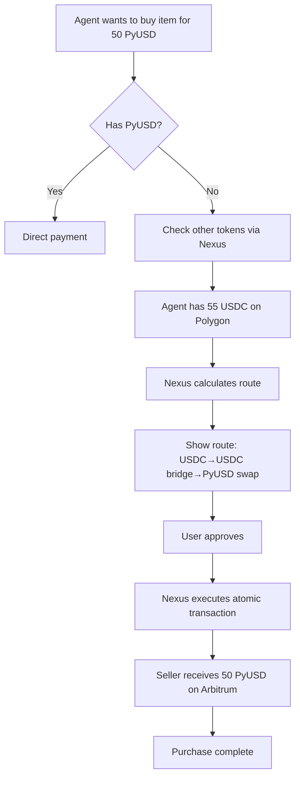
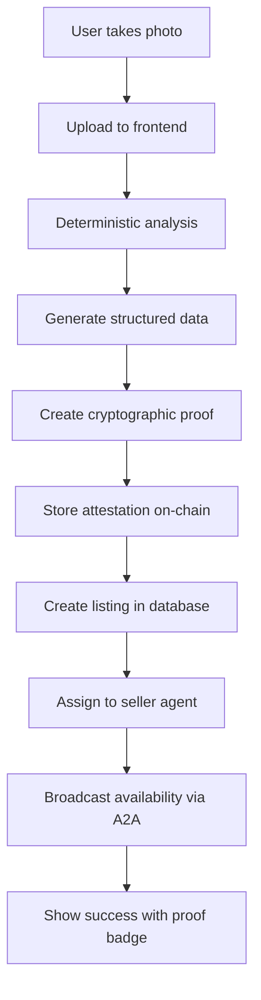

## Product Summary

### Vision

A decentralized marketplace where AI agents autonomously handle commerce on behalf of users. The platform enables frictionless peer-to-peer transactions where sellers simply photograph items for AI-powered listing creation, and buyers describe their needs in natural language for AI-mediated discovery and purchase.

### Basic Summary

An **AI-powered decentralized marketplace** where users buy and sell physical goods using **autonomous AI agents** that handle listings, negotiations, and **on-chain crypto payments**.

- **Seller:** Uploads item photo → AI generates listing → Seller Agent posts.

- **Buyer:** Chats “Adidas shoes < $60” → Buyer Agent searches, negotiates, and pays.

- **Payment:** ERC-20 (PYUSD) on Ethereum / L2; cross-chain handled by **Avail Nexus**.

- **Wallets:** Each Agent has a **Vincent (Lit Protocol)** wallet.

- **Audit + History:** via **Blockscout SDK**.

- **Analytics + Dashboard:** via **Envio HyperSync**.


## Core Technologies

|Layer|Technology|Purpose|
|---|---|---|
|**AI Processing**|Vercel AI SDK + OpenAI GPT-4 Vision|Image analysis, natural language processing|
|**Smart Contracts**|Hardhat 3 + Solidity 0.8.24|Development, testing, deployment framework|
|**Blockchain Indexing**|Envio HyperSync|Ultra-fast data indexing, market analytics dashboard|
|**Agent Communication**|A2A Protocol (JSON-RPC)|Standardized inter-agent messaging|
|**Blockchain**|Ethereum L2 (Arbitrum/Base)|Low-cost, high-throughput transactions|
|**Wallets**|Lit Protocol Vincent|Policy-based autonomous agent wallets|
|**Payments**|PyUSD (ERC-20)|Stablecoin for marketplace transactions|
|**Transaction Monitoring**|Blockscout SDK|Real-time notifications, transaction history|
|**Cross-chain**|Avail Nexus|Multi-token payments and L1↔L2 bridging|
|**Frontend**|Next.js 14 + TypeScript + Tailwind|User interface and experience|
|**Database**|PostgreSQL + Prisma|Listing storage with vector embeddings|


## Technical Architecture

┌─────────────────────────────────────────────────────────────────┐
│                      USER INTERFACE LAYER                         │
│                   Next.js + React + Tailwind CSS                  │
│  ┌─────────────┐ ┌──────────────┐ ┌─────────────────────────┐  │
│  │Photo Upload │ │Agent Dashboard│ │ Market Activity Dashboard │  │
│  │  Component  │ │   (Real-time) │ │   (Envio HyperSync)      │  │
│  └─────────────┘ └──────────────┘ └─────────────────────────┘  │
└─────────────────────────────────────────────────────────────────┘
                                 ↓
┌─────────────────────────────────────────────────────────────────┐
│                    BLOCKCHAIN INDEXING LAYER                      │
│                      (Envio HyperSync - 2000x faster)            │
│  ┌──────────────┐ ┌──────────────┐ ┌──────────────────────┐   │
│  │  Multi-Chain │ │  Real-time   │ │   GraphQL API        │   │
│  │   Indexer    │ │Event Streaming│ │  Market Queries      │   │
│  │ (70+ chains) │ │   WebSocket  │ │   Analytics          │   │
│  └──────────────┘ └──────────────┘ └──────────────────────┘   │
│         ↓                ↓                    ↓                  │
│  ┌────────────────────────────────────────────────────────┐    │
│  │     Market Activity Tracking & Agent Performance       │    │
│  └────────────────────────────────────────────────────────┘    │
└─────────────────────────────────────────────────────────────────┘
                                 ↓
┌─────────────────────────────────────────────────────────────────┐
│                    AI AGENT ORCHESTRATION LAYER                   │
│  ┌────────────────────────────────────────────────────────┐    │
│  │              Marketplace Search Agent                    │    │
│  │  • Vector embeddings for semantic search                │    │
│  │  • Natural language query processing                    │    │
│  │  • AI-powered result ranking                           │    │
│  └────────────────────────────────────────────────────────┘    │
│                          ↓              ↓                        │
│  ┌──────────────────┐                  ┌──────────────────┐    │
│  │   Buyer Agents   │  ←─────A2A────→  │  Seller Agents   │    │
│  │ • Search queries │                  │ • Listing mgmt   │    │
│  │ • Negotiation    │                  │ • Price updates  │    │
│  │ • Purchase exec  │                  │ • Item delivery  │    │
│  └──────────────────┘                  └──────────────────┘    │
└─────────────────────────────────────────────────────────────────┘
                                 ↓
┌─────────────────────────────────────────────────────────────────┐
│                 AUTONOMOUS WALLET INFRASTRUCTURE                  │
│                      (Lit Protocol Vincent)                       │
│  ┌────────────────────────────────────────────────────────┐    │
│  │              Programmable Key Pairs (PKPs)              │    │
│  │  • MPC key sharding across Lit nodes                   │    │
│  │  • Policy engine with spending controls                │    │
│  │  • Multi-chain wallet support                          │    │
│  │  • Session keys for temporary permissions              │    │
│  └────────────────────────────────────────────────────────┘    │
└─────────────────────────────────────────────────────────────────┘
                                 ↓
┌─────────────────────────────────────────────────────────────────┐
│          TRANSACTION MONITORING & NOTIFICATIONS                   │
│  ┌────────────────────────────────────────────────────────┐    │
│  │  Blockscout SDK: Real-time tx notifications & history  │    │
│  └────────────────────────────────────────────────────────┘    │
└─────────────────────────────────────────────────────────────────┘
                                 ↓
┌─────────────────────────────────────────────────────────────────┐
│                    BLOCKCHAIN SETTLEMENT LAYER                    │
│  ┌────────────────────────────────────────────────────────┐    │
│  │          Smart Contracts (Deployed via Hardhat)         │    │
│  │  • Marketplace.sol (listing & escrow management)        │    │
│  │  • AgentRegistry.sol (agent tracking)                  │    │
│  │  • PaymentRouter.sol (multi-token handling)            │    │
│  └────────────────────────────────────────────────────────┘    │
│                              ↓                                   │
│  ┌──────────────────┐  ┌──────────────┐  ┌────────────────┐   │
│  │  Arbitrum L2     │  │   Base L2    │  │  Avail Nexus   │   │
│  │  (Primary)       │  │  (Secondary) │  │   (Multi-token │   │
│  │  Gas: ~$0.10     │  │  Gas: ~$0.05 │  │    Payments)   │   │
│  └──────────────────┘  └──────────────┘  └────────────────┘   │
└─────────────────────────────────────────────────────────────────┘

## 3. Core Features & Requirements

### 3.1 AI-Powered Image Analysis & Listing Creation

#### Requirements

- **Input**: Product photo (JPEG/PNG, max 10MB)
- **Processing Time**: <3 seconds
- **Output**: Structured listing with metadata


## 4. Feature Overview

### 4.1 Image-Based Listing

- Upload image → AI (Vision) → structured listing JSON (Zod).

- Seller edits, posts via API.

### 4.2 Agents & Negotiation

- Buyer Agent: search / offer.

- Seller Agent: accept / reject.

- Messages exchanged via A2A provider.
### 4.3 Payments & Wallets

- Vincent PKP wallet per Agent.

- Same-chain → ERC-20 transfer.

- Cross-chain → Avail Nexus Bridge + Swap.


### 4.4 Smart Contracts (Hardhat)

| Contract | Function |

|-----------|-----------|

| `AgentRegistry.sol` | Maps agent IDs ↔ wallets |

| `MarketplaceEscrow.sol` | Holds ERC-20 funds until release |

| `OrderLedger.sol` | Append-only log of orders + events |


### 4.5 Transaction History + Notifications

- **Blockscout SDK:** show tx list, ERC-20 transfers, status updates.

- **TxMonitor:** detects incoming/outgoing txs → pushes WebSocket events.


### 4.6 Market Activity Dashboard (Envio HyperSync)

- Backend queries Envio HyperSync for all Agent wallets across chains.

- Aggregates transfers by token, network, agent.

- Frontend renders:

- Total market volume (last 24h / 7d / 30d)

- Token breakdown

- Network distribution

- Top agents by volume

- Live feed of latest transactions


---

## 3. Core Features & Requirements


```

### 3.3 Agent-to-Agent Communication Protocol

#### A2A Message Structure
```json
{
  "jsonrpc": "2.0",
  "method": "marketplace.search",
  "params": {
    "query": "Nike shoes under $60",
    "buyerAgentId": "agent_123",
    "maxResults": 10,
  }
}
```

#### Response with Proofs
```json
{
  "jsonrpc": "2.0",
  "result": {
    "matches": [...],
    "proofs": {
      "searchProof": "0x...",
      "rankingProof": "0x...",
      "enclaveAttestation": "0x..."
    }
  },
  "id": "req_456"
}
```

### 3.4 Vincent Wallet Policy Engine

#### Agent Wallet Policies
```typescript
interface AgentWalletPolicy {
  // Spending limits
  maxTransactionValue: bigint;      // e.g., 100 PYUSD
  dailySpendingLimit: bigint;       // e.g., 500 PYUSD

  // Security requirements
  requireProofForTransaction: boolean;  // Always true
  approvedContractAddresses: string[];  // Marketplace contracts only

  // Operational constraints
  maxGasPrice: bigint;              // Prevent drain attacks
  allowedTokens: string[];          // PYUSD, ETH for gas

  // Time-based rules
  operationalHours?: {
    start: number;  // Hour in UTC
    end: number;    // Hour in UTC
  };

  // Multi-sig requirements
  highValueThreshold?: bigint;      // Requires additional approval
  requiredSigners?: string[];       // For high-value transactions
}
```

### 3.5 Avail Nexus Integration - Universal Payment Acceptance

#### Core Problem Solved
Agents may hold different tokens (USDC, USDT, ETH, MATIC) across various chains but sellers expect PyUSD. Avail Nexus enables **any agent to pay with any token on any supported chain**, automatically handling conversion and bridging.

#### Integration Architecture
```typescript
interface NexusPaymentFlow {
  // Agent's current holdings
  agentBalance: {
    token: string;        // e.g., "USDC"
    amount: bigint;       // e.g., 100000000 (100 USDC)
    chain: ChainId;       // e.g., ChainId.POLYGON
  };

  // Seller's requirement
  sellerRequirement: {
    token: "PYUSD";       // Always PyUSD for this marketplace
    amount: bigint;       // Price in PyUSD
    chain: ChainId;       // e.g., ChainId.ARBITRUM
  };

  // Nexus handles the conversion
  nexusRoute: {
    fromToken: string;    // Agent's token
    toToken: "PYUSD";     // Target token
    fromChain: ChainId;   // Agent's chain
    toChain: ChainId;     // Seller's chain
    steps: RouteStep[];   // Swap/bridge operations
  };
}
```

#### Agent Payment Service with Nexus
```typescript
import { NexusSDK } from '@avail-project/nexus';

class UniversalPaymentService {
  private nexus: NexusSDK;

  constructor() {
    this.nexus = new NexusSDK({
      apiKey: process.env.NEXUS_API_KEY,
      chains: [
        ChainId.ETHEREUM,
        ChainId.ARBITRUM,
        ChainId.BASE,
        ChainId.POLYGON,
        ChainId.OPTIMISM
      ]
    });
  }

  async executePaymentWithAnyToken(
    buyerAgent: Agent,
    sellerAddress: string,
    priceInPYUSD: bigint,
  ) {
    // Step 1: Check what tokens the buyer agent has
    const agentBalances = await this.nexus.getUnifiedBalances(
      buyerAgent.walletAddress
    );

    // Step 2: Find best token/chain combination for payment
    const bestOption = await this.selectOptimalPaymentSource(
      agentBalances,
      priceInPYUSD
    );

    if (!bestOption) {
      throw new Error("Insufficient balance across all tokens");
    }

    // Step 3: Get routing from agent's token to PyUSD
    const route = await this.nexus.getRoute({
      fromToken: bestOption.token,      // e.g., "USDC"
      fromChain: bestOption.chain,      // e.g., POLYGON
      toToken: "PYUSD",                 // Always PyUSD
      toChain: ChainId.ARBITRUM,        // Marketplace chain
      amount: priceInPYUSD,
      slippage: 0.5                     // 0.5% max slippage
    });

    // Step 4: Show routing to user for transparency
    console.log(`Payment Route:
      From: ${bestOption.amount} ${bestOption.token} on ${bestOption.chain}
      To: ${priceInPYUSD} PYUSD on Arbitrum
      Steps: ${route.steps.length} (${route.estimatedTime}s)
      Fees: ${route.totalFees} USD
    `);

    // Step 5: Execute the cross-chain payment
    const txResult = await this.nexus.executeRoute({
      route,
      fromAddress: buyerAgent.walletAddress,
      toAddress: sellerAddress,
      proof: proof.hash, // Attach proof for verification
      callbacks: {
        onStepComplete: (step) => {
          // Update UI with progress
          this.notifyProgress(step);
        }
      }
    });

    // Step 6: Log to EigenDA with full route details
    await this.logToEigenDA({
      buyer: buyerAgent.id,
      seller: sellerAddress,
      originalToken: bestOption.token,
      originalChain: bestOption.chain,
      finalAmount: priceInPYUSD,
      route: route,
      txHashes: txResult.transactionHashes,
      proof: proof
    });

    return txResult;
  }

  private async selectOptimalPaymentSource(
    balances: TokenBalance[],
    requiredAmount: bigint
  ): Promise<PaymentSource | null> {
    // Sort by lowest bridge/swap fees
    const options = await Promise.all(
      balances
        .filter(b => b.valueInUSD >= requiredAmount)
        .map(async (balance) => ({
          ...balance,
          estimatedFees: await this.nexus.estimateFees({
            fromToken: balance.token,
            fromChain: balance.chain,
            toToken: "PYUSD",
            toChain: ChainId.ARBITRUM,
            amount: requiredAmount
          })
        }))
    );

    // Return option with lowest fees
    return options.sort((a, b) => a.estimatedFees - b.estimatedFees)[0];
  }
}
```

#### Supported Token Matrix for Agents
```typescript
const NEXUS_SUPPORTED_TOKENS = {
  // Stablecoins (1:1 with PyUSD)
  USDC: {
    chains: [ETHEREUM, ARBITRUM, POLYGON, BASE, OPTIMISM],
    directSwap: true,
    typicalFee: "0.1%"
  },
  USDT: {
    chains: [ETHEREUM, ARBITRUM, POLYGON],
    directSwap: true,
    typicalFee: "0.1%"
  },
  DAI: {
    chains: [ETHEREUM, ARBITRUM, POLYGON],
    directSwap: true,
    typicalFee: "0.2%"
  },

  // Native tokens (variable rates)
  ETH: {
    chains: [ETHEREUM, ARBITRUM, BASE, OPTIMISM],
    requiresPriceOracle: true,
    typicalFee: "0.3%"
  },
  MATIC: {
    chains: [POLYGON],
    requiresPriceOracle: true,
    typicalFee: "0.3%"
  }
};
```

#### User Experience Flow


#### Smart Contract Integration
```solidity
contract NexusEnabledMarketplace is VerifiableMarketplace {
    INexusRouter public nexusRouter;

    // Accept payment from any Nexus-supported token
    function purchaseWithAnyToken(
        string calldata listingId,
        address paymentToken,
        uint256 paymentAmount,
        bytes calldata nexusRouteData,
        bytes32 decisionProof
    ) external requiresProof(decisionProof) {
        Listing memory listing = listings[listingId];

        // Verify Nexus route will deliver correct PyUSD amount
        require(
            nexusRouter.verifyRoute(
                nexusRouteData,
                paymentToken,
                paymentAmount,
                address(pyusd),
                listing.price
            ),
            "Invalid payment route"
        );

        // Execute cross-chain payment via Nexus
        bytes32 nexusId = nexusRouter.initiatePayment(
            msg.sender,
            listing.seller,
            nexusRouteData
        );

        // Mark as pending until Nexus confirms
        purchases[listingId] = Purchase({
            buyer: msg.sender,
            nexusPaymentId: nexusId,
            status: PurchaseStatus.PENDING_NEXUS,
            decisionProof: decisionProof
        });

        emit PurchaseInitiated(listingId, nexusId);
    }

    // Callback from Nexus when payment completes
    function nexusPaymentCallback(
        bytes32 nexusId,
        bool success
    ) external onlyNexusRouter {
        // Update purchase status based on Nexus result
        // Release item to buyer if successful
    }
}
```

### 3.7 Envio HyperSync Integration - Market Activity Dashboard

#### Core Purpose
Envio HyperSync provides ultra-fast blockchain data indexing (up to 2000x faster than RPC) to create real-time market activity dashboards tracking all agent wallets, transactions, and marketplace events across multiple chains simultaneously.

#### Integration Architecture
```typescript
interface MarketActivityDashboard {
  // Real-time metrics from HyperSync
  metrics: {
    totalAgents: number;
    activeAgents24h: number;
    totalTransactionVolume: bigint;
    averageListingPrice: bigint;
    topPerformingAgents: Agent[];
    recentTransactions: Transaction[];
  };

  // Agent wallet tracking
  agentActivity: {
    walletAddress: string;
    chainId: number;
    transactionCount: number;
    totalVolume: bigint;
    successRate: number;
    lastActive: Date;
  }[];

  // Cross-chain analytics
  chainBreakdown: {
    chainName: string;
    transactionCount: number;
    volumeInPyusd: bigint;
    gasSpent: bigint;
    activeAgents: number;
  }[];
}
```

#### HyperSync Setup and Configuration
```typescript
// config.yaml for Envio HyperIndex
name: VerifiableMarketplace
description: AI Agent Marketplace Activity Tracker
networks:
  - id: 42161  # Arbitrum
    start_block: 0  # HyperSync auto-detects contract deployment
    contracts:
      - name: VerifiableMarketplace
        abi_file_path: abis/marketplace.json
        address: ${MARKETPLACE_ADDRESS}
        handler: ./src/EventHandlers.ts
        events:
          - event: ListingCreated
          - event: PurchaseInitiated
          - event: PaymentVerified
          - event: AgentRegistered
  - id: 137  # Polygon
    start_block: 0
    contracts:
      - name: AgentWalletTracker
        address: ${AGENT_REGISTRY_ADDRESS}
  - id: 8453  # Base
    start_block: 0
```

#### Event Handlers for Market Activity
```typescript
// src/EventHandlers.ts
import { VerifiableMarketplace } from "../generated";

// Track listing creation with agent details
VerifiableMarketplace.ListingCreated.handler(async ({ event, context }) => {
  const { listingId, seller, price, aiProofHash, timestamp } = event.params;

  // Update agent activity
  await context.Agent.upsert({
    id: seller,
    totalListings: (agent) => agent.totalListings + 1,
    lastActivity: timestamp,
    totalVolume: (agent) => agent.totalVolume + price
  });

  // Store listing event
  await context.ListingEvent.create({
    id: `${listingId}-created`,
    type: "CREATED",
    agentId: seller,
    price,
    proofHash: aiProofHash,
    timestamp,
    chainId: event.chainId
  });

  // Update market metrics
  await updateMarketMetrics(context, {
    newListing: true,
    price,
    chainId: event.chainId
  });
});

// Track purchases with cross-chain support
VerifiableMarketplace.PurchaseInitiated.handler(async ({ event, context }) => {
  const { buyer, seller, amount, paymentToken, sourceChain } = event.params;

  // Track cross-chain payment if via Nexus
  if (sourceChain !== event.chainId) {
    await context.CrossChainPayment.create({
      id: event.transactionHash,
      fromChain: sourceChain,
      toChain: event.chainId,
      buyer,
      seller,
      amount,
      token: paymentToken
    });
  }

  // Update both agents
  await updateAgentMetrics(context, buyer, seller, amount);
});

// Track agent registration
VerifiableMarketplace.AgentRegistered.handler(async ({ event, context }) => {
  const { agentId, walletAddress, vincentPkpId, eigenAvsId } = event.params;

  await context.Agent.create({
    id: agentId,
    walletAddress,
    vincentPkpId,
    eigenAvsId,
    registeredAt: event.timestamp,
    chainId: event.chainId,
    isVerified: !!eigenAvsId,
    totalTransactions: 0,
    successRate: 100
  });
});
```

#### Real-time Dashboard Component
```typescript
// app/components/MarketActivityDashboard.tsx
import { useQuery, useSubscription } from '@envio/hyperindex-react';
import { HyperSyncClient } from '@envio-dev/hypersync-client';

export function MarketActivityDashboard() {
  const [liveMetrics, setLiveMetrics] = useState<MarketMetrics>();
  const hyperSync = new HyperSyncClient({ apiKey: process.env.ENVIO_API_KEY });

  // Query indexed data via GraphQL
  const { data: marketData } = useQuery({
    query: gql`
      query MarketMetrics {
        agents(first: 100, orderBy: totalVolume, orderDirection: desc) {
          id
          walletAddress
          totalListings
          totalPurchases
          totalVolume
          successRate
          lastActivity
        }
        recentTransactions(first: 50, orderBy: timestamp, orderDirection: desc) {
          id
          buyer
          seller
          amount
          token
          sourceChain
          destinationChain
          timestamp
        }
        marketMetrics {
          totalAgents
          activeAgents24h
          totalVolume24h
          averageListingPrice
          topCategory
        }
      }
    `
  });

  // Subscribe to real-time events
  useSubscription({
    subscription: gql`
      subscription LiveActivity {
        transactionCreated {
          id
          type
          agentId
          amount
          chainId
        }
      }
    `,
    onData: (data) => {
      updateLiveMetrics(data.transactionCreated);
    }
  });

  // Stream real-time data from multiple chains
  useEffect(() => {
    async function streamMultiChainData() {
      const stream = await hyperSync.streamEvents({
        chains: [42161, 137, 8453], // Arbitrum, Polygon, Base
        address: [MARKETPLACE_ADDRESS, AGENT_REGISTRY_ADDRESS],
        fromBlock: "latest",
        eventSignatures: [
          "ListingCreated(string,address,uint256,bytes32)",
          "PurchaseInitiated(string,address,address,uint256)",
          "AgentActivity(address,string,uint256)"
        ]
      });

      stream.on('data', (event) => {
        processLiveEvent(event);
      });
    }

    streamMultiChainData();
  }, []);

  return (
    <div className="market-dashboard">
      {/* Header Metrics */}
      <div className="metrics-grid">
        <MetricCard
          title="Total Agents"
          value={marketData?.marketMetrics.totalAgents}
          change="+12%"
          icon={<Users />}
        />
        <MetricCard
          title="24h Volume"
          value={`${formatPyusd(marketData?.marketMetrics.totalVolume24h)} PyUSD`}
          change="+25%"
          icon={<DollarSign />}
        />
        <MetricCard
          title="Active Agents (24h)"
          value={marketData?.marketMetrics.activeAgents24h}
          change="+8%"
          icon={<Activity />}
        />
        <MetricCard
          title="Avg Listing Price"
          value={`${formatPyusd(marketData?.marketMetrics.averageListingPrice)} PyUSD`}
          icon={<TrendingUp />}
        />
      </div>

      {/* Top Performing Agents */}
      <div className="top-agents">
        <h3>Top Performing Agents</h3>
        <AgentLeaderboard agents={marketData?.agents} />
      </div>

      {/* Live Activity Feed */}
      <div className="activity-feed">
        <h3>Live Market Activity</h3>
        <LiveActivityFeed transactions={liveMetrics?.recentTransactions} />
      </div>

      {/* Chain Distribution */}
      <div className="chain-analytics">
        <h3>Cross-Chain Activity</h3>
        <ChainDistributionChart data={marketData?.chainBreakdown} />
      </div>

      {/* Agent Performance Heatmap */}
      <div className="agent-heatmap">
        <h3>Agent Activity Heatmap</h3>
        <AgentActivityHeatmap agents={marketData?.agents} />
      </div>
    </div>
  );
}
```

#### HyperSync Data Analytics Service
```typescript
// lib/analytics/HyperSyncAnalytics.ts
import { HyperSyncClient } from '@envio-dev/hypersync-client';

class MarketAnalyticsService {
  private client: HyperSyncClient;

  constructor() {
    this.client = new HyperSyncClient({
      apiKey: process.env.ENVIO_API_KEY
    });
  }

  // Get agent performance across all chains
  async getAgentPerformance(agentAddress: string) {
    const queries = [42161, 137, 8453].map(chainId =>
      this.client.query({
        chainId,
        fromBlock: 0,
        toBlock: "latest",
        transactions: [
          {
            from: [agentAddress],
            to: [MARKETPLACE_ADDRESS]
          }
        ],
        logs: [
          {
            address: [MARKETPLACE_ADDRESS],
            topics: [
              [], // any event
              [agentAddress] // involving this agent
            ]
          }
        ],
        fieldSelection: {
          transaction: ["hash", "value", "gasUsed", "timestamp"],
          log: ["data", "topics", "timestamp"]
        }
      })
    );

    const results = await Promise.all(queries);

    // Aggregate cross-chain data
    return {
      totalTransactions: results.reduce((sum, r) => sum + r.transactions.length, 0),
      totalVolume: results.reduce((sum, r) => sum + calculateVolume(r), 0n),
      chainBreakdown: results.map((r, i) => ({
        chainId: [42161, 137, 8453][i],
        transactions: r.transactions.length,
        volume: calculateVolume(r)
      })),
      timeline: generateActivityTimeline(results)
    };
  }

  // Stream real-time market events
  async streamMarketEvents(callback: (event: MarketEvent) => void) {
    const stream = await this.client.streamLogs({
      chains: [42161, 137, 8453],
      address: [MARKETPLACE_ADDRESS],
      fromBlock: "latest",
      eventSignatures: [
        "ListingCreated(string,address,uint256,bytes32)",
        "PurchaseInitiated(string,address,address,uint256)",
        "PaymentVerified(string,bytes32)",
        "DisputeRaised(string,address)"
      ]
    });

    stream.on('data', (log) => {
      const event = this.parseMarketEvent(log);
      callback(event);
    });

    return stream;
  }

  // Analyze market trends over time
  async analyzeMarketTrends(timeRange: { from: Date; to: Date }) {
    const fromBlock = await this.getBlockByTimestamp(timeRange.from);
    const toBlock = await this.getBlockByTimestamp(timeRange.to);

    const data = await this.client.query({
      chainId: 42161,
      fromBlock,
      toBlock,
      logs: [
        {
          address: [MARKETPLACE_ADDRESS],
          topics: [
            [
              "0x...", // ListingCreated signature
              "0x..."  // PurchaseInitiated signature
            ]
          ]
        }
      ],
      transactions: [],
      fieldSelection: {
        log: ["data", "topics", "blockNumber", "timestamp"]
      }
    });

    return this.processMarketTrends(data);
  }

  // Export market data for analysis
  async exportMarketData(format: 'json' | 'parquet' | 'arrow') {
    const allData = await this.client.query({
      chainId: 42161,
      fromBlock: 0,
      toBlock: "latest",
      logs: [{ address: [MARKETPLACE_ADDRESS] }],
      outputFormat: format
    });

    return allData;
  }
}
```

#### Visual Analytics Components
```typescript
// app/components/analytics/AgentActivityHeatmap.tsx
export function AgentActivityHeatmap({ agents }: { agents: Agent[] }) {
  const heatmapData = useMemo(() => {
    // Group agents by activity level and time
    return agents.map(agent => ({
      id: agent.id,
      data: generateHeatmapData(agent.activityHistory)
    }));
  }, [agents]);

  return (
    <div className="heatmap-container">
      <svg width="800" height="400">
        {heatmapData.map((agent, i) => (
          <g key={agent.id} transform={`translate(0, ${i * 20})`}>
            {agent.data.map((activity, j) => (
              <rect
                key={j}
                x={j * 15}
                y={0}
                width="12"
                height="18"
                fill={getHeatmapColor(activity.intensity)}
                opacity={activity.intensity / 100}
              >
                <title>{`Agent ${agent.id}: ${activity.count} transactions`}</title>
              </rect>
            ))}
          </g>
        ))}
      </svg>
    </div>
  );
}

// app/components/analytics/LiveTransactionFlow.tsx
export function LiveTransactionFlow() {
  const [flows, setFlows] = useState<TransactionFlow[]>([]);

  useEffect(() => {
    const analytics = new MarketAnalyticsService();
    const stream = analytics.streamMarketEvents((event) => {
      if (event.type === 'PurchaseInitiated') {
        setFlows(prev => [...prev.slice(-20), {
          from: event.buyer,
          to: event.seller,
          amount: event.amount,
          timestamp: Date.now()
        }]);
      }
    });

    return () => stream.close();
  }, []);

  return (
    <div className="transaction-flow">
      {flows.map((flow, i) => (
        <TransactionFlowAnimation
          key={i}
          from={flow.from}
          to={flow.to}
          amount={flow.amount}
          delay={i * 100}
        />
      ))}
    </div>
  );
}
```

### 3.8 Smart Contract Architecture

#### Core Contracts (Hardhat Project Structure)
```
contracts/
├── VerifiableMarketplace.sol     # Main marketplace logic
├── AgentRegistry.sol              # Agent verification & tracking
├── ProofValidator.sol             # EigenLayer proof validation
├── EscrowManager.sol              # Payment escrow handling
├── interfaces/
│   ├── IEigenAI.sol
│   ├── IEigenDA.sol
│   └── IPyUSD.sol
├── libraries/
│   ├── ProofLib.sol
│   └── EscrowLib.sol
└── test/
    ├── VerifiableMarketplace.t.sol  # Solidity tests
    └── mocks/
        ├── MockERC20.sol
        └── MockEigenLayer.sol
```

#### Key Contract Functions
```solidity
contract VerifiableMarketplace {
    // Listing management with proofs
    function createListing(
        string calldata listingId,
        uint256 price,
        bytes32 aiProofHash,
        bytes32 eigenAttestation
    ) external requiresProof(aiProofHash);

    // Purchase with verification
    function purchaseWithProof(
        string calldata listingId,
        bytes32 decisionProof
    ) external requiresProof(decisionProof);

    // Escrow release after verification
    function releaseEscrow(
        string calldata listingId,
        bytes32 deliveryProof
    ) external;

    // Dispute resolution with proof arbitration
    function initiateDispute(
        string calldata listingId,
        bytes32 disputeProof
    ) external;
}
```

### 3.6 Transaction Monitoring & Analytics

#### Blockscout SDK Integration
```typescript
interface AgentActivityDashboard {
  // Real-time metrics
  activeTransactions: Transaction[];
  pendingOperations: Operation[];
  recentNotifications: Notification[];

  // Historical analytics
  performance: {
    totalTransactions: number;
    successRate: number;
    averageResponseTime: number;
    totalVolume: bigint;
    gasSpent: bigint;
  };

  // Agent portfolio
  portfolio: {
    tokens: TokenBalance[];
    listings: ActiveListing[];
    purchases: CompletedPurchase[];
  };

  // Verification stats
  proofMetrics: {
    proofsGenerated: number;
    proofsVerified: number;
    attestationsOnChain: number;
    eigenDaEntries: number;
  };
}
```

## 4. User Flows

### 4.1 Seller Flow - Photo to Listing



### 4.2 Buyer Flow - Natural Language to Purchase (Any Token)

```mermaid
graph TD
    A[User: "Buy Nike shoes"] --> B[Buyer agent activated]
    B --> C[Check agent wallet balance]
    C --> D{Has PyUSD?}
    D -->|No| E[Has other tokens?]
    D -->|Yes| F[Direct PyUSD payment]
    E --> G[Nexus: Find best token]
    G --> H[Example: Agent has 60 USDC on Polygon]
    H --> I[Nexus calculates route to PyUSD]
    I --> J[Show route: Polygon USDC → Bridge → Arbitrum USDC → Swap → PyUSD]
    J --> K[Estimate: 0.3% fees, 45 seconds]
    K --> L[User approves cross-chain payment]
    L --> M[Nexus executes atomically]
    M --> N[Seller receives PyUSD]
    F --> N
    N --> O[Item marked as sold]
    O --> P[Log complete route to EigenDA]
```


## 5. Technical Implementation Details

### 5.1 Development Environment Setup

#### Required Tools & Versions
- Node.js: v18+ (v22 recommended for Hardhat 3)
- Python: 3.10-3.13 (for uAgent fallback)

- Git: Latest

#### Package Dependencies
```json
{
  "dependencies": {
    "@vercel/ai": "^3.0.0",
    "openai": "^4.0.0",
    "@blockscout/sdk": "^1.0.0",
    "@lit-protocol/vincent-sdk": "latest",
    "@avail-project/nexus": "latest",
    "ethers": "^6.0.0",
    "viem": "^2.0.0",
    "next": "^14.0.0",
    "prisma": "^5.0.0",
    "zod": "^3.0.0"
  },
  "devDependencies": {
    "hardhat": "^2.20.0",
    "@nomicfoundation/hardhat-toolbox": "^4.0.0",
    "@nomicfoundation/hardhat-ignition": "^0.15.0",
    "@nomicfoundation/hardhat-verify": "^2.0.0",
    "@openzeppelin/contracts": "^5.0.0",
    "solidity-coverage": "^0.8.0",
    "hardhat-gas-reporter": "^1.0.0"
  }
}
```

## 5. Technical Implementation Details

### 5.1 Development Environment Setup

#### Required Tools & Versions
- Node.js: v18+ (v22 recommended for Hardhat 3)
- Python: 3.10-3.13 (for uAgent fallback)
- Git: Latest

#### Package Dependencies
```json
{
  "dependencies": {
    "@vercel/ai": "^3.0.0",
    "openai": "^4.0.0",
    "@blockscout/sdk": "^1.0.0",
    "@lit-protocol/vincent-sdk": "latest",
    "@avail-project/nexus": "latest",
    "@avail-project/nexus-widgets": "latest",
    "ethers": "^6.0.0",
    "viem": "^2.0.0",
    "next": "^14.0.0",
    "prisma": "^5.0.0",
    "zod": "^3.0.0"
  },
  "devDependencies": {
    "hardhat": "^2.20.0",
    "@nomicfoundation/hardhat-toolbox": "^4.0.0",
    "@nomicfoundation/hardhat-ignition": "^0.15.0",
    "@nomicfoundation/hardhat-verify": "^2.0.0",
    "@openzeppelin/contracts": "^5.0.0",
    "solidity-coverage": "^0.8.0",
    "hardhat-gas-reporter": "^1.0.0"
  }
}
```

### 5.2 Avail Nexus Integration Points

#### 5.2.1 Frontend Integration - Payment Widget
```typescript
// app/components/PaymentSelector.tsx
import { NexusPaymentWidget } from '@avail-project/nexus-widgets';
import { useNexus } from '@avail-project/nexus/react';

export function PaymentSelector({
  listing,
  agentWallet
}: {
  listing: Listing;
  agentWallet: string;
}) {
  const { sdk } = useNexus();
  const [paymentOptions, setPaymentOptions] = useState<PaymentOption[]>([]);

  useEffect(() => {
    // Get all possible payment options for this agent
    async function loadOptions() {
      const balances = await sdk.getUnifiedBalances(agentWallet);

      // Filter to tokens with sufficient balance
      const viableOptions = await Promise.all(
        balances.map(async (balance) => {
          if (balance.valueInUSD < listing.price) return null;

          const route = await sdk.previewRoute({
            fromToken: balance.token,
            fromChain: balance.chainId,
            toToken: 'PYUSD',
            toChain: ARBITRUM_CHAIN_ID,
            amount: listing.price
          });

          return {
            token: balance.token,
            chain: balance.chainName,
            balance: balance.amount,
            estimatedFees: route.totalFees,
            estimatedTime: route.estimatedTime,
            route
          };
        })
      );

      setPaymentOptions(viableOptions.filter(Boolean));
    }

    loadOptions();
  }, [agentWallet, listing.price]);

  return (
    <div className="payment-options">
      <h3>Select Payment Method</h3>
      {paymentOptions.length === 0 ? (
        <div className="alert">
          Insufficient balance. Please fund your agent wallet.
        </div>
      ) : (
        <div className="options-grid">
          {paymentOptions.map(option => (
            <PaymentOptionCard
              key={`${option.token}-${option.chain}`}
              option={option}
              onSelect={() => executePayment(option)}
              recommended={option.estimatedFees === Math.min(...paymentOptions.map(o => o.estimatedFees))}
            />
          ))}
        </div>
      )}

      {/* Nexus widget for visual route display */}
      <NexusPaymentWidget
        fromAddress={agentWallet}
        toAddress={listing.sellerAddress}
        amount={listing.price}
        targetToken="PYUSD"
        targetChain={ARBITRUM_CHAIN_ID}
        onSuccess={(txHash) => handlePaymentSuccess(txHash)}
        onError={(error) => handlePaymentError(error)}
      />
    </div>
  );
}
```

#### 5.2.2 Agent Service - Multi-Token Balance Management
```typescript
// lib/agents/BuyerAgent.ts
class BuyerAgent {
  private nexus: NexusSDK;
  private wallet: VincentWallet;

  async checkPurchasingPower(): Promise<PurchasingPower> {
    // Get balances across all chains
    const unifiedBalances = await this.nexus.getUnifiedBalances(
      this.wallet.address
    );

    // Calculate total purchasing power in PyUSD equivalent
    const purchasingPower = await Promise.all(
      unifiedBalances.map(async (balance) => {
        // Get conversion rate to PyUSD
        const quote = await this.nexus.getQuote({
          fromToken: balance.token,
          toToken: 'PYUSD',
          amount: balance.amount
        });

        return {
          token: balance.token,
          chain: balance.chainId,
          originalAmount: balance.amount,
          pyusdEquivalent: quote.outputAmount,
          conversionFee: quote.fee
        };
      })
    );

    // Total available for purchases
    const totalPyusdEquivalent = purchasingPower.reduce(
      (sum, p) => sum + p.pyusdEquivalent - p.conversionFee,
      0n
    );

    return {
      totalPyusdEquivalent,
      breakdown: purchasingPower,
      recommendedPaymentToken: this.selectOptimalToken(purchasingPower)
    };
  }

  async executePurchaseWithOptimalToken(
    listing: Listing,
  ): Promise<PurchaseResult> {
    const purchasingPower = await this.checkPurchasingPower();

    if (purchasingPower.totalPyusdEquivalent < listing.price) {
      throw new Error('Insufficient funds across all tokens');
    }

    // Find best token to use (lowest fees)
    const optimalPayment = purchasingPower.breakdown
      .filter(b => b.pyusdEquivalent >= listing.price)
      .sort((a, b) => a.conversionFee - b.conversionFee)[0];

    // Execute cross-chain payment
    const paymentResult = await this.nexus.bridgeAndSwap({
      fromToken: optimalPayment.token,
      fromChain: optimalPayment.chain,
      toToken: 'PYUSD',
      toChain: ARBITRUM_CHAIN_ID,
      amount: listing.price,
      recipient: listing.sellerAddress,
      metadata: {
        listingId: listing.id,
        buyerAgent: this.id,
        proof: proof.hash
      }
    });

    // Log the complete payment route
    await this.logPaymentRoute(paymentResult, optimalPayment, listing);

    return paymentResult;
  }
}
```

#### 5.2.3 Dashboard - Cross-Chain Portfolio View
```typescript
// app/components/AgentPortfolio.tsx
export function AgentPortfolio({ agentId }: { agentId: string }) {
  const { data: portfolio } = useAgentPortfolio(agentId);
  const { sdk } = useNexus();

  return (
    <div className="portfolio-dashboard">
      <h2>Agent Multi-Chain Portfolio</h2>

      {/* Total value across all chains */}
      <div className="total-value">
        <h3>Total Value (PyUSD Equivalent)</h3>
        <span className="amount">{portfolio.totalValuePyusd}</span>
        <span className="usd">${portfolio.totalValueUSD}</span>
      </div>

      {/* Breakdown by chain and token */}
      <div className="chain-breakdown">
        {portfolio.chains.map(chain => (
          <ChainCard key={chain.id}>
            <h4>{chain.name}</h4>
            <div className="tokens">
              {chain.tokens.map(token => (
                <TokenBalance
                  key={token.address}
                  token={token}
                  pyusdEquivalent={token.pyusdValue}
                  conversionRoute={
                    <NexusRoutePreview
                      from={token}
                      to="PYUSD"
                      amount={token.balance}
                    />
                  }
                />
              ))}
            </div>
            <button onClick={() => consolidateToPyusd(chain)}>
              Consolidate to PyUSD
            </button>
          </ChainCard>
        ))}
      </div>

      {/* Quick actions using Nexus */}
      <div className="quick-actions">
        <h3>Cross-Chain Actions</h3>
        <button onClick={() => rebalancePortfolio()}>
          Rebalance Portfolio
        </button>
        <button onClick={() => bridgeAllToPyusd()}>
          Convert All to PyUSD
        </button>
        <button onClick={() => optimizeForGas()}>
          Optimize for Low Gas
        </button>
      </div>
    </div>
  );
}
```

#### 5.2.4 Monitoring - Nexus Transaction Tracking
```typescript
// lib/monitoring/NexusMonitor.ts
class NexusTransactionMonitor {
  private nexus: NexusSDK;
  private blockscout: BlockscoutService;

  async monitorCrossChainPayment(
    nexusTransactionId: string,
    callbacks: {
      onBridgeInitiated: (data: any) => void;
      onBridgeComplete: (data: any) => void;
      onSwapComplete: (data: any) => void;
      onFinalDelivery: (data: any) => void;
    }
  ) {
    // Subscribe to Nexus events
    const subscription = await this.nexus.subscribe(nexusTransactionId);

    subscription.on('bridge_initiated', (event) => {
      console.log(`Bridge started: ${event.fromChain} → ${event.toChain}`);
      callbacks.onBridgeInitiated(event);

      // Track on source chain via Blockscout
      this.blockscout.trackTransaction(event.sourceTxHash, event.fromChain);
    });

    subscription.on('bridge_complete', (event) => {
      console.log(`Bridge complete: Received on ${event.toChain}`);
      callbacks.onBridgeComplete(event);

      // Track on destination chain
      this.blockscout.trackTransaction(event.destTxHash, event.toChain);
    });

    subscription.on('swap_complete', (event) => {
      console.log(`Swap complete: ${event.fromToken} → ${event.toToken}`);
      callbacks.onSwapComplete(event);
    });

    subscription.on('payment_delivered', (event) => {
      console.log(`Payment delivered to seller: ${event.amount} PyUSD`);
      callbacks.onFinalDelivery(event);


    return subscription;
  }

  async generatePaymentProofOfRoute(
    nexusTransactionId: string
  ): Promise<RouteProof> {
    // Get complete transaction history from Nexus
    const routeHistory = await this.nexus.getTransactionHistory(
      nexusTransactionId
    );

    // Generate proof of the complete payment route
    return {
      nexusId: nexusTransactionId,
      steps: routeHistory.steps.map(step => ({
        action: step.action,
        txHash: step.txHash,
        chainId: step.chainId,
        blockNumber: step.blockNumber,
        timestamp: step.timestamp
      })),
      originalToken: routeHistory.fromToken,
      originalAmount: routeHistory.fromAmount,
      finalToken: 'PYUSD',
      finalAmount: routeHistory.toAmount,
      totalFees: routeHistory.totalFees
    };
  }
}
```

### 5.3 Smart Contract Testing Strategy

#### Test Coverage Requirements
- Unit Tests: >95% line coverage
- Integration Tests: All user flows
- Fuzz Tests: 10,000 runs minimum
- Gas Optimization: <200k for listings, <300k for purchases
- Fork Tests: Against mainnet PyUSD

#### Hardhat Test Configuration
```typescript
// hardhat.config.ts
export default {
  solidity: {
    version: "0.8.24",
    settings: {
      optimizer: {
        enabled: true,
        runs: 200,
        details: {
          yul: true,
          yulDetails: {
            stackAllocation: true,
            optimizerSteps: "dhfoDgvulfnTUtnIf"
          }
        }
      },
      viaIR: true
    }
  },
  gasReporter: {
    enabled: true,
    currency: "USD",
    gasPrice: 21,
    outputFile: "gas-report.txt",
    noColors: true
  },
  networks: {
    hardhat: {
      forking: {
        url: process.env.ETHEREUM_RPC!,
        blockNumber: 19000000
      },
      chainId: 1337
    },
    "arbitrum-sepolia": {
      url: process.env.ARBITRUM_SEPOLIA_RPC!,
      accounts: [process.env.DEPLOYER_PRIVATE_KEY!],
      gasPrice: 100000000, // 0.1 gwei
      timeout: 60000
    }
  }
};
```

### 5.3 API Endpoints

#### Core API Routes
```typescript
// Image Analysis
POST /api/analyze
Body: { image: base64 }
Response: { listing: {...}, proof: {...} }

// Agent Operations
POST /api/agents/create
GET /api/agents/:id/history
POST /api/agents/:id/execute

// Marketplace
GET /api/listings?query=...
POST /api/listings
GET /api/listings/:id
POST /api/listings/:id/purchase

// Verification
POST /api/verify/proof
GET /api/verify/attestation/:hash
GET /api/verify/audit/:listingId

// Monitoring (via Blockscout)
GET /api/transactions/:agentId
GET /api/analytics/:agentId
WebSocket: /api/activity/stream
```

### 5.4 Database Schema (Prisma)

```prisma
model Listing {
  id               String   @id @default(cuid())
  title            String
  description      String   @db.Text
  imageUrl         String
  price            Decimal  @db.Decimal(20, 6)
  category         String
  condition        String
  features         Json
  searchTags       String[]

  // Agent relationships
  sellerAgentId    String
  buyerAgentId     String?


  // Status
  status           ListingStatus @default(AVAILABLE)
  soldAt           DateTime?

  // Metadata
  createdAt        DateTime @default(now())
  updatedAt        DateTime @updatedAt

  // Relations
  sellerAgent      Agent    @relation("seller", fields: [sellerAgentId], references: [id])
  buyerAgent       Agent?   @relation("buyer", fields: [buyerAgentId], references: [id])
  transactions     Transaction[]
  proofs           Proof[]

  @@index([status, category])
  @@index([sellerAgentId])
  @@index([searchTags])
}

model Agent {
  id               String   @id @default(cuid())
  type             AgentType
  walletAddress    String   @unique
  vincentPkpId     String?

  // Policies
  policies         Json
  spendingLimit    Decimal  @db.Decimal(20, 6)

  // Performance
  totalTransactions Int     @default(0)
  successRate      Float    @default(100)
  totalVolume      Decimal  @default(0) @db.Decimal(20, 6)

  // Relations
  listings         Listing[] @relation("seller")
  purchases        Listing[] @relation("buyer")
  transactions     Transaction[]

  createdAt        DateTime @default(now())
  updatedAt        DateTime @updatedAt

  @@index([type, walletAddress])
}

model Transaction {
  id               String   @id @default(cuid())
  hash             String   @unique

  // Participants
  fromAgentId      String
  toAgentId        String
  listingId        String

  // Details
  amount           Decimal  @db.Decimal(20, 6)
  token            String   @default("PYUSD")


  // Status
  status           TxStatus
  blockNumber      Int?
  gasUsed          BigInt?

  // Relations
  fromAgent        Agent    @relation(fields: [fromAgentId], references: [id])
  listing          Listing  @relation(fields: [listingId], references: [id])

  createdAt        DateTime @default(now())
  confirmedAt      DateTime?

  @@index([status, fromAgentId])
  @@index([hash])
}


enum ListingStatus {
  AVAILABLE
  PENDING
  SOLD
  CANCELLED
  DISPUTED
}

enum AgentType {
  BUYER
  SELLER
  MARKETPLACE
  ARBITRATOR
}

enum TxStatus {
  PENDING
  CONFIRMED
  FAILED
  REVERTED
}

enum ProofType {
  AI_ANALYSIS
  AGENT_DECISION
  PURCHASE
  DISPUTE
  DELIVERY
}
```

### 5.5 Security Considerations

#### Threat Model
1. **Proof Forgery**: Prevented by cryptographic signatures
2. **Wallet Drain**: Limited by Vincent policy engine
3. **Front-running**: Reduced by commit-reveal patterns
4. **Reentrancy**: Prevented by OpenZeppelin guards

#### Security Measures
```solidity
// Contract Security Patterns
contract SecureMarketplace is
    ReentrancyGuard,
    Pausable,
    AccessControl
{
    // Rate limiting
    mapping(address => uint256) public lastAction;
    uint256 public constant ACTION_COOLDOWN = 1 minutes;

    modifier rateLimited() {
        require(
            block.timestamp >= lastAction[msg.sender] + ACTION_COOLDOWN,
            "Too frequent"
        );
        lastAction[msg.sender] = block.timestamp;
        _;
    }

    }

    // Emergency functions
    function emergencyPause() external onlyRole(PAUSER_ROLE) {
        _pause();
        emit EmergencyPause(msg.sender, block.timestamp);
    }
}
```

## 6. Implementation

### Phase 0: Pre-Hackathon Setup (Day 0 - 4 hours)

- [ ] Install development tools (Hardhat)
- [ ] Configure environment variables
- [ ] Test tool access and APIs

### Phase 1: Foundation (Day 1 - 10 hours)
**Morning (5 hours)**:
- [ ] Initialize Next.js + TypeScript project
- [ ] Setup Hardhat environment
- [ ] Install Blockscout SDK
- [ ] Create database schema

**Afternoon (5 hours)**:
- [ ] Write VerifiableMarketplace contract
- [ ] Create test suite (Solidity + TypeScript)
- [ ] Implement image analysis with proofs
- [ ] Setup notification system
- [ ] Deploy to local Hardhat node

### Phase 2: Agent Infrastructure (Day 2 - 12 hours)
**Morning (6 hours)**:
- [ ] Build marketplace search agent
- [ ] Configure TEE attestation
- [ ] Test enclave wallet

**Afternoon (6 hours)**:
- [ ] Implement A2A protocol server
- [ ] Create buyer/seller agents
- [ ] Setup agent communication


### Phase 3: Wallet & Payments (Day 3 - 10 hours)
**Morning (5 hours)**:
- [ ] Integrate Vincent SDK
- [ ] Configure policy engine
- [ ] Setup proof requirements
- [ ] Test with fork mainnet

**Afternoon (5 hours)**:
- [ ] Deploy contracts with Ignition
- [ ] Implement PyUSD payments
- [ ] Test escrow mechanism
- [ ] Optimize gas usage
- [ ] Verify on Etherscan

### Phase 4: Integration & L2 (Day 4 - 8 hours)
**Morning (4 hours)**:
- [ ] Deploy to Base
- [ ] Configure multi-chain
- [ ] Test proof generation on L2
- [ ] Run coverage report

**Afternoon (4 hours)**:
- [ ] End-to-end testing
- [ ] Fork testing mainnet
- [ ] Performance optimization
- [ ] Audit trail verification
- [ ] Generate artifacts

### Phase 5: Polish & Demo (Day 5 - 8 hours)
**Morning (4 hours)**:
- [ ] UI/UX improvements
- [ ] Proof visualization
- [ ] Final testing
- [ ] Bug fixes

**Afternoon (4 hours)**:
- [ ] Demo script preparation
- [ ] Verification demonstrations
- [ ] Fund test wallets
- [ ] Practice presentation


### 8.3 Avail Nexus Specific Scenarios

#### Scenario 1: Agent Has USDC on Polygon
```typescript
// Agent wallet status
{
  wallet: "0xAgent123...",
  balances: [
    { token: "USDC", chain: "Polygon", amount: "100.00" }
  ]
}

// Purchase requirement
{
  item: "Nike Shoes",
  price: "50.00 PYUSD",
  seller: "0xSeller456...",
  chain: "Arbitrum"
}

// Nexus automatically handles:
// 1. Bridge USDC from Polygon to Arbitrum (~30 seconds)
// 2. Swap USDC to PyUSD on Arbitrum (~5 seconds)
// 3. Transfer PyUSD to seller
// Total cost: 50 PyUSD + 0.15 USD fees
```

#### Scenario 2: Agent Has Multiple Tokens
```typescript
// Agent has fragmented portfolio
{
  balances: [
    { token: "ETH", chain: "Ethereum", amount: "0.01", value: "$35" },
    { token: "MATIC", chain: "Polygon", amount: "50", value: "$45" },
    { token: "USDC", chain: "Base", amount: "20", value: "$20" }
  ]
}

// For $60 purchase, Nexus recommends:
{
  option1: {
    use: ["MATIC on Polygon", "USDC on Base"],
    route: "MATIC→USDC→Bridge→PyUSD + Base USDC→Bridge→PyUSD",
    totalFees: "$0.75",
    time: "45 seconds"
  },
  option2: {
    use: ["ETH on Ethereum", "USDC on Base"],
    route: "ETH→PyUSD + Bridge Base USDC→Arbitrum PyUSD",
    totalFees: "$2.50", // Higher due to Ethereum L1
    time: "2 minutes"
  }
}
// System auto-selects option1 for lower fees
```

#### Scenario 3: Insufficient Single Token
```typescript
// No single token covers the price
{
  itemPrice: "100 PyUSD",
  agentBalances: [
    { token: "USDC", amount: "60", chain: "Arbitrum" },
    { token: "USDT", amount: "45", chain: "Polygon" }
  ]
}

// Nexus combines tokens:
{
  solution: "Multi-token payment",
  steps: [
    "1. Bridge 45 USDT from Polygon to Arbitrum",
    "2. Swap 40 USDT to PyUSD on Arbitrum",
    "3. Combine with 60 USDC→PyUSD swap",
    "4. Send 100 PyUSD to seller"
  ],
  totalFromAgent: "60 USDC + 40 USDT",
  totalToSeller: "100 PyUSD",
  fees: "$0.45"
}
```


## 11. Resources & Documentation

### 11.1 Technical Documentation
- [Vercel AI SDK Docs](https://sdk.vercel.ai/docs)
- [EigenLayer Documentation](https://docs.eigencloud.xyz)
- [Hardhat Documentation](https://hardhat.org/docs)
- [Blockscout SDK Docs](https://docs.blockscout.com/devs/blockscout-sdk)
- [Vincent Documentation](https://docs.heyvincent.ai)
- [A2A Protocol Spec](https://github.com/a2aproject/A2A)

### 11.3 Repository Structure
```
crypto-marketplace/
├── README.md
├── AGENTS.md
├── package.json
├── hardhat.config.ts
├── .env.example
├── contracts/           # Smart contracts
├── test/               # Contract tests
├── ignition/           # Deployment modules
├── scripts/            # Utility scripts
├── app/                # Next.js frontend
├── lib/                # Shared libraries
├── agents/             # Agent implementations
└── docs/               # Documentation
